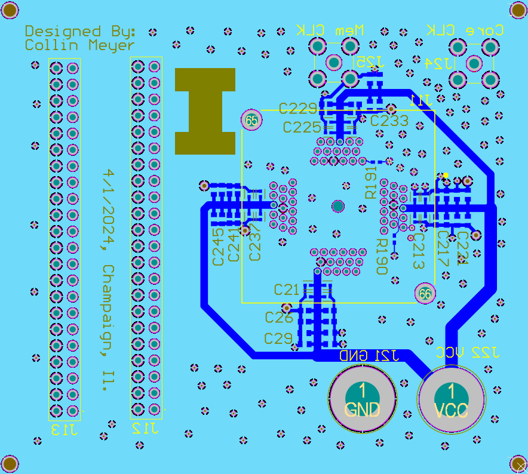

# MacroHard PCB Design

This repo contains the Altium Designer files corresponding to the PCB we will use to do silicon bringup
on our TSMC 65nm RISC-V core.

## Current PCB

### Front

### Back

## Current Schematic

<object data="https://github.com/cmmeyer1800/MacrohardPCB/docs/schematic.pdf" type="application/pdf" width="700px" height="700px">
    <embed src="https://github.com/cmmeyer1800/MacrohardPCB/docs/schematic.pdf">
        
This browser does not support PDFs. Please download the PDF to view it: <a href="http://yoursite.com/the.pdf">Download PDF</a>.

    </embed>
</object>