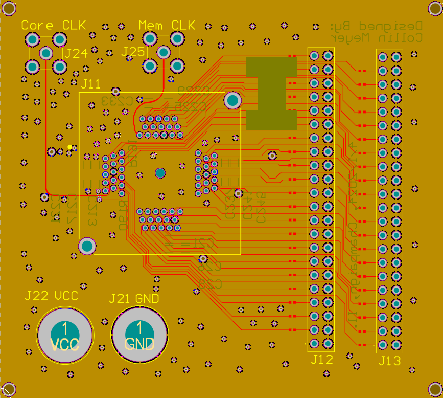

# MacroHard PCB Design

This repo contains the Altium Designer files corresponding to the PCB we will use to do silicon bringup
on our TSMC 65nm RISC-V core.

## Current PCB

### Front

### Back

## Current Schematic

